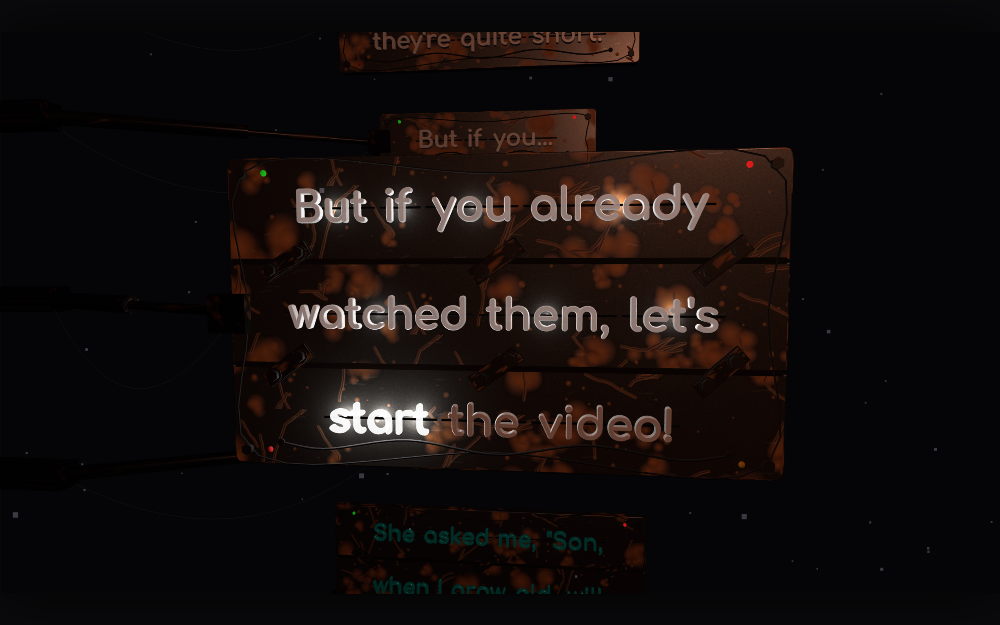
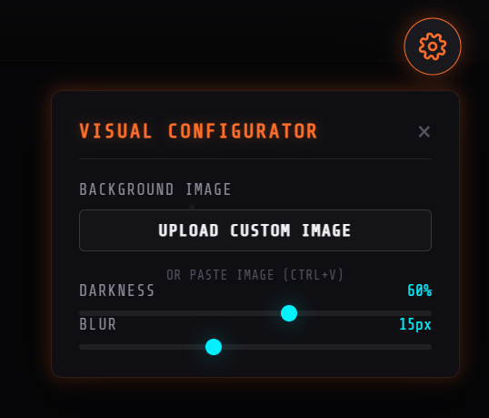
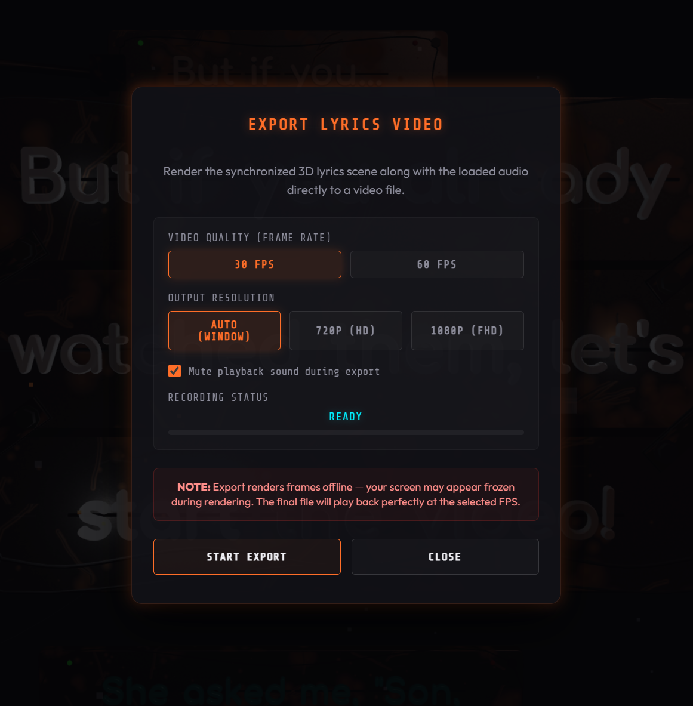

# Lyrics Machine — 3D Synchronized Lyrics Viewer

A cinematic 3D synchronized lyrics viewer powered by Three.js. Load audio and `.lrc` files locally and watch the lyrics play out as a 3D scene, or export the whole thing directly to a video file.

## Screenshots

### 3D Lyrics Scene



Each lyric line is rendered on a textured 3D panel that lights up in sync with the audio.

### Visual Configurator



The Visual Configurator lets you set a custom background image and fine-tune its darkness and blur.

### Export Lyrics Video



The export dialog renders the synchronized 3D scene and audio directly to a video file at 30 or 60 FPS, up to 1080p.

## Features

- Cinematic Three.js lyrics scene synced to audio playback (standard + word-timed `.lrc`)
- Local audio loading (MP3, WAV, M4A, OGG, AAC) with drag & drop
- Visual configurator: custom background image (upload or paste), darkness and blur controls
- Video export: render the synchronized 3D scene + audio directly to a video file (30/60 FPS, up to 1080p)
- Accessibility fallback text overlay and non-WebGL mode

## Getting Started

```bash
npm install
npm run dev
```

Open the dev server URL, then load an audio file and an `.lrc` lyrics file (or hit **Load Sample** to try the bundled sample).

## Scripts

| Script          | Description              |
| --------------- | ------------------------ |
| `npm run dev`   | Start the dev server     |
| `npm run build` | Type-check + build       |
| `npm run preview` | Preview the build      |
| `npm test`      | Run tests with Vitest    |
